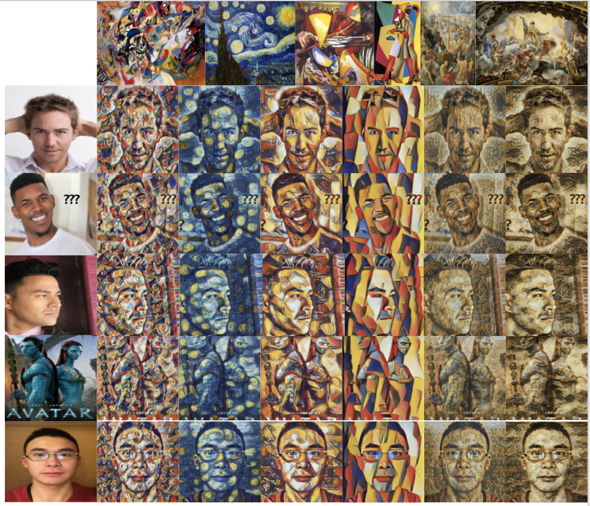
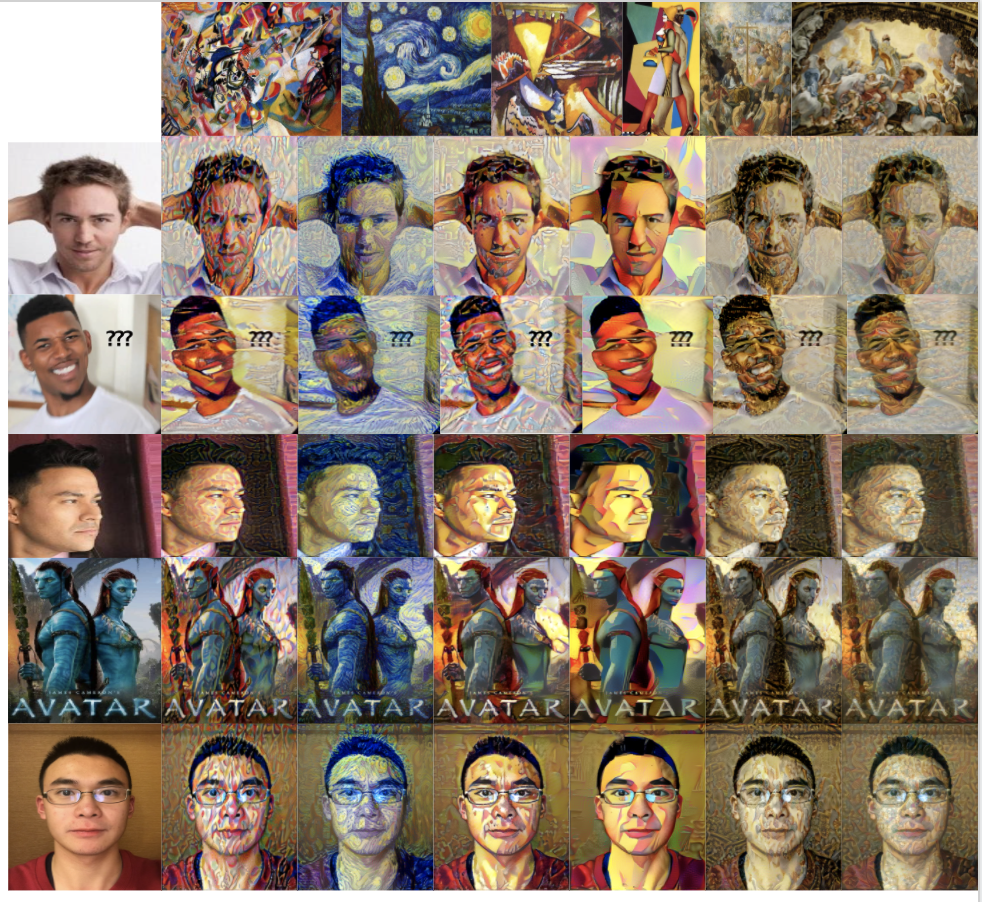
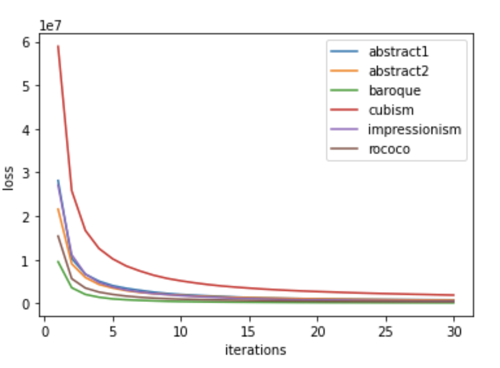
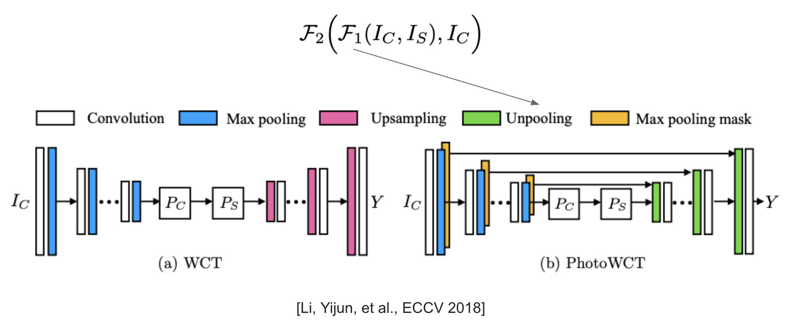
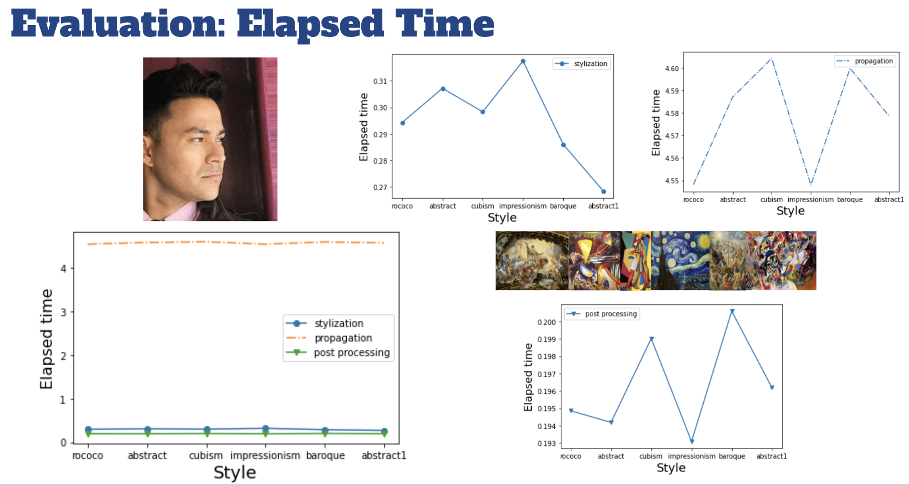

# StyleTransfer

## Description

Neural style transfer is an optimization technique used to take two images—a content image and a style reference image (such as an artwork by a famous painter)—and blend them together so the output image looks like the content image, but "painted" in the style of the style reference image.

This is implemented by optimizing the output image to match the content statistics of the content image and the style statistics of the style reference image. These statistics are extracted from the images using a convolutional network.

## Data

[Celebrity Photos](http://mmlab.ie.cuhk.edu.hk/projects/CelebA.html)

[Visual art encyclopedia Wikiart](https://www.wikiart.org/)

## Methods

### Method 1

#### Implementation
Run [style_transfer.ipynb](./method1/style_transfer.ipynb).
The first cell gives the notebook access to google drive. So if the datasets are put in the google drive, run the first cell first and get access. After that, run all cells left and get results.
You may change the file path to get more different results with different styles and contents.

#### Structure of Model
1 Has a function that cut images from the center, a function that load and resize images and a function that display images.
The model behind this images is arbitrary neural artistic stylization network. It consists of style transfer network and style prediction network. There are two kinds of losses: style loss and content loss. The model use convolutional networks to minimize the total loss and produces stylized images.

#### Results
Shown in the picture are contents of faces with some noise in the background, profile, bodies and face with a clear background. For styles, we choose abstract, impressionism, cubism baroque and rococo.

#### Discussion
The CNN model works best when there is a front face with a clear background. For different styles, baroque generates the best results because the average loss is the smallest. When there is a profile or a body on the image, the result is not so clear compared to faces. Also, the model does not work on cubism as well as on other styles.

### Method 2

#### Implementation
Run [NeuralStyleTransfer.ipynb](./method2/NeuralStyleTransfer.ipynb).
This is the notebook from github repo: https://github.com/titu1994/Neural-Style-Transfer. The code of building the network is in INetwork.py. loss_processing .ipynb is used for processing the loss output files. Partial generated image results are in the folder "method2/generated_images". Output files recording the loss are in the folder "method2/loss_output".

#### Structure of Model
There is a VGG to extract features from images and an optimizier to modify the generated image to reduce the loss. There are three inputs for the VGG network: content image, style image, and a generated image, which could be initialized as a content image, a gray content image, or an image with random noises. The total loss has two parts: content loss and style loss, the weight between these two weights could also be set as a hyperparameter. The generated image is updated in every iteration, and the results get better with a larger number of iterations.

#### Results
We use the same content and style images as in method 1. The generated image is initialized as the content image and the number of iterations is set as 30. For qualitative evaluation, we could notice there are colors and brushes from certain style images. For quantitative evaluation, we compare the convergence speeds of losses for different style images.

#### Discussion
Qualitatively, the generated images look similar when the style images have similar colors: Look at the results from style baroque and rococo. Also, the generated images have more content features than styles. The reason is that the initialization is the content image and the number of iterations is relatively small. The generated image should encode more style features with more iterations. Quantitatively, we could notice that different styles have different speeds of convergence for the same content image. Cubism has the highest loss at the first epoch and the loss convergences quickly over 5 iterations. 

### Method 3 -- Photorealistic Image Stylization

#### Implementation

Run [PhotoWCT+Smoothing.ipynb](./method3/PhotoWCT+Smoothing.ipynb)

The code is derivied from [NVIDIA/FastPhotoStyle](https://github.com/NVIDIA/FastPhotoStyle).

#### Structure of Model

The algorithm derives from [A Closed-form Solution to Photorealistic Image Stylization](https://arxiv.org/abs/1802.06474). It keeps the content image photorealistic by applying a smoothing algorithm after a stylization algorithm, which is called photoWCT. It is based on the WCT, short for whitening and coloring transform. It utilizes the VGG-19 model as the encoder and trains a decoder for reconstructing the input image. The decoder is symmetric to the encoder and uses upsampling layers to enlarge the spatial resolutions of the feature maps. Once the auto-encoder is trained, a pair of projection functions are inserted at the network bottleneck to perform stylization through the whitening and coloring transforms. Here, photoWCT replaces the upsampling layers with unpooling layers, which are used together with the max pooling mask.

#### Results

We gathered the elapsed time for stylization, smoothing and post-processing. As we can see, the processing time mainly depends on the time for propagation which is one of the smoothing techniques.

#### Discussion

Qualitatively, photorealistic image stylization is not as good as other neural style tranfer as it maintains the structure of the content. However, if you want to keep photorealistic of the image not being distorted, it will be a better choice for you.

## Paper

[Art Nouveau Style Transfer with Face Alignment](http://cs230.stanford.edu/projects_fall_2019/reports/26261057.pdf)

[Exploring the structure of a real-time, arbitrary neural artistic stylization network](https://arxiv.org/pdf/1705.06830.pdf)

## Tutorial

[Fast Style Transfer for Arbitrary Styles](https://www.tensorflow.org/hub/tutorials/tf2_arbitrary_image_stylization)

[Exploring the structure of a real-time, arbitrary neural artistic stylization network](https://github.com/magenta/magenta/tree/master/magenta/models/arbitrary_image_stylization)

[Tensorflow_image_stylization](https://github.com/Robinatp/Tensorflow_image_stylization)

https://paperswithcode.com/paper/exploring-the-structure-of-a-real-time

## References
1. Yeh, Mao-Chuang, et al. "Quantitative evaluation of style transfer." arXiv preprint arXiv:1804.00118 (2018).
2. https://www.tensorflow.org/hub/tutorials/tf2_arbitrary_image_stylization
3. Gatys, Leon A., Alexander S. Ecker, and Matthias Bethge. "A neural algorithm of artistic style." arXiv preprint arXiv:1508.06576 (2015).
4. https://github.com/titu1994/Neural-Style-Transfer/tree/f8b18a4e6f3d7fb86ed5d2dfb1bae7e89ba48d9d
5. Li, Yijun, et al. "A closed-form solution to photorealistic image stylization." Proceedings of the European Conference on Computer Vision (ECCV). 2018.
6. https://github.com/NVIDIA/FastPhotoStyle
7. https://github.com/clovaai/stargan-v2

